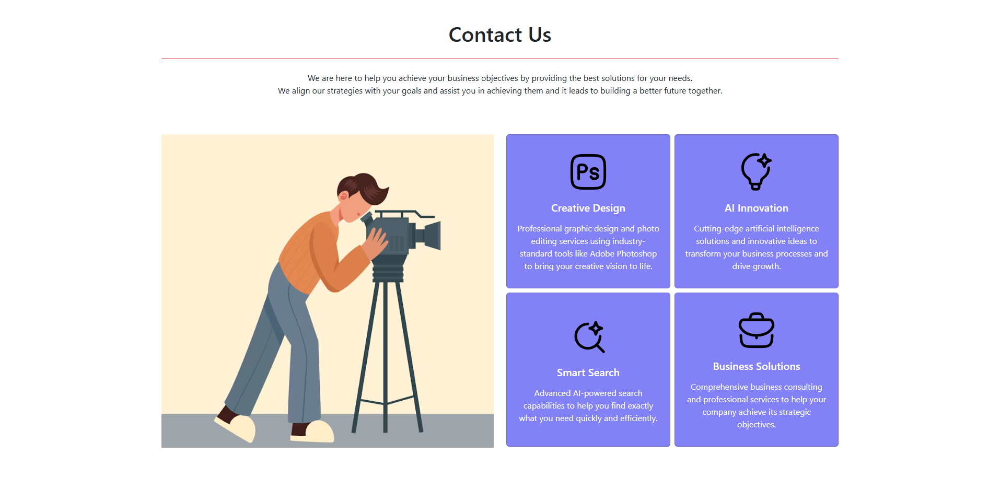

# Contact Us Page

A modern, responsive contact page built with Bootstrap 5 featuring a clean split-layout design with service cards.

## Preview



## Features

- **Responsive Design**: Fully responsive layout that works on desktop, tablet, and mobile devices
- **Split Layout**: 50/50 split design with hero image on the left and service cards on the right
- **Service Cards**: Four interactive service cards with custom icons and descriptions
- **Modern Styling**: Clean, professional design with custom blue card styling
- **Bootstrap 5**: Built using the latest Bootstrap framework for consistency and responsiveness

## Technologies Used

- HTML5
- CSS3
- Bootstrap 5.3.7
- SVG Icons (HugeIcons)


## Services Highlighted

1. **Creative Design** - Professional graphic design and photo editing services using industry-standard tools
2. **AI Innovation** - Cutting-edge artificial intelligence solutions and innovative ideas
3. **Smart Search** - Advanced AI-powered search capabilities
4. **Business Solutions** - Comprehensive business consulting and professional services

## Design Features

### Layout
- **Left Panel**: Hero image with 600px height and responsive scaling
- **Right Panel**: 2x2 grid of service cards with matching height
- **Equal Heights**: Both panels maintain consistent 600px height for visual balance

### Styling
- **Card Background**: Semi-transparent blue (`rgba(57, 57, 241, 0.63)`)
- **Text Color**: White text for contrast
- **Icons**: 80px x 80px SVG icons for each service
- **Responsive Grid**: Cards adjust from 2 columns to 1 column on smaller screens

## Getting Started

1. **Clone or Download** the project files
2. **Open** `index.html` in your web browser
3. **Customize** the content, colors, and services as needed

## Customization

### Changing Colors
Update the CSS in the `<style>` section of `index.html`:

```css
.card {
    background-color: rgba(57, 57, 241, 0.63) !important; /* Change this color */
    color: white !important;
}
```

### Adding New Services
1. Add a new SVG icon to the `assets/` folder
2. Duplicate one of the existing card `<div>` structures
3. Update the icon source, title, and description

### Updating the Hero Image
Replace the Unsplash URL in the `src` attribute with your desired image URL or local file path.


## Credits

- **Bootstrap**: [getbootstrap.com](https://getbootstrap.com/)
- **Icons**: HugeIcons
- **Hero Image**: Unsplash

## License

This project is open source and available under the [MIT License](https://opensource.org/licenses/MIT).

---

*Created for demonstrating modern web design principles with Bootstrap 5*
